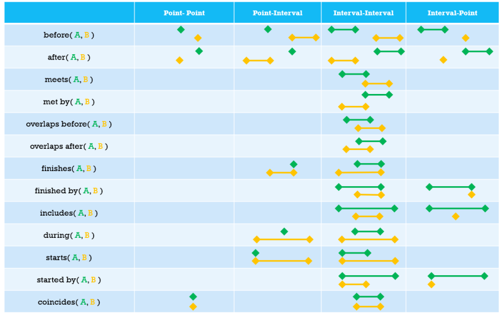

A set of functions establish relationships between single scalar values and ranges of such values.
All functions take two arguments and return `true` if the relationship between the argument holds,
or `false` otherwise.

A scalar value must be of the following type:

- number
- date
- time
- date-time
- days-time-duration
- years-months-duration



## before()

- parameters:
  - `point1`, `point2`: any
  - or `range`: range, `point`: any
  - or `point`: any, `range`: range
  - or `range1`, `range2`: range
- result: boolean

```js
before(1, 10)
// true

before(10, 1)
// false

before(1, [2..5])
// true

before([1..5], 10)
// true

before([1..5], [6..10])
// true

before([1..5),[5..10])
// true
```

## after()

- parameters:
  - `point1`, `point2`: any
  - or `range`: range, `point`: any
  - or `point`: any, `range`: range
  - or `range1`, `range2`: range
- result: boolean

```js
after(10, 1)
// true

after(1, 10)
// false

after(12, [2..5])
// true

([1..5], 10)
// false

before([6..10], [1..5])
// true

before([5..10], [1..5))
// true
```

## meets()

- parameters:
  - `range1`: range
  - `range2`: range
- result: boolean

```js
meets([1..5], [5..10])
// true

meets([1..3], [4..6])
// false

meets([1..3], [3..5])
// true

meets([1..5], (5..8])
// false

```

## met by()

- parameters:
  - `range1`: range
  - `range2`: range
- result: boolean

```js
met by([5..10], [1..5])
// true

met by([3..4], [1..2])
// false

met by([3..5], [1..3])
// true

met by((5..8], [1..5))
// false

met by([5..10], [1..5))
// false
```

## overlaps()

- parameters:
  - `range1`: range
  - `range2`: range
- result: boolean

```js
overlaps([5..10], [1..6])
// true

overlaps((3..7], [1..4])
// true

overlaps([1..3], (3..6])
// false

overlaps((5..8], [1..5))
// false

overlaps([4..10], [1..5))
// treu
```

## overlaps before()

- parameters:
  - `range1`: range
  - `range2`: range
- result: boolean

```js
overlaps before([1..5], [4..10])
// true

overlaps before([3..4], [1..2])
// false

overlaps before([1..3], (3..5])
// false

overlaps before([1..5), (3..8])
// true

overlaps before([1..5), [5..10])
// false
```

## overlaps after()

- parameters:
  - `range1`: range
  - `range2`: range
- result: boolean

```js
overlaps after([4..10], [1..5])
// true

overlaps after([3..4], [1..2])
// false

overlaps after([3..5], [1..3))
// false

overlaps after((5..8], [1..5))
// false

overlaps after([4..10], [1..5))
// true
```

## finishes()

- parameters:
  - `point`: any, `range`: range
  - or `range1`, `range2`: range
- result: boolean

```js
finishes(5, [1..5])
// true

finishes(10, [1..7])
// false

finishes([3..5], [1..5])
// true

finishes((1..5], [1..5))
// false

finishes([5..10], [1..10))
// false
```

## finished by()

- parameters:
  - `range`: range, `point`: any
  - or `range1`, `range2`: range
- result: boolean

```js
finished by([5..10], 10)
// true

finished by([3..4], 2)
// false

finished by([1..5], [3..5])
// true

finished by((5..8], [1..5))
// false

finished by([5..10], (1..10))
// false
```

## includes()

- parameters:
  - `range`: range, `point`: any
  - or `range1`, `range2`: range
- result: boolean

```js
includes([5..10], 6)
// true

includes([3..4], 5)
// false

includes([1..10], [4..6])
// true

includes((5..8], [1..5))
// false

includes([1..10], [1..5))
// true
```

## during()

- parameters:
  - `point`: any, `range`: range
  - or `range1`, `range2`: range
- result: boolean

```js
during(5, [1..10])
// true

during(12, [1..10])
// false

during(1, (1..10])
// false

during([4..6], [1..10))
// true

during((1..5], (1..10])
// true
```

## starts()

- parameters:
  - `point`: any, `range`: range
  - or `range1`, `range2`: range
- result: boolean

```js
starts(1, [1..5])
// true

starts(1, (1..8])
// false

starts((1..5], [1..5])
// false

starts([1..10], [1..5])
// false

starts((1..5), (1..10))
// true
```

## started by()

- parameters:
  - `range`: range, `point`: any
  - or `range1`, `range2`: range
- result: boolean

```js
started by([1..10], 1)
// true

started by((1..10], 1)
// false

started by([1..10], [1..5])
// true

started by((1..10], [1..5))
// false

started by([1..10], [1..10))
// true
```

## coincides()

- parameters:
  - `point1`, `point2`: any
  - or `range1`, `range2`: range
- result: boolean

```js
coincides(5, 5)
// true

coincides(3, 4)
// false

coincides([1..5], [1..5])
// true

coincides((1..5], [1..5))
// false

coincides([1..5], [2..6])
// false
```
